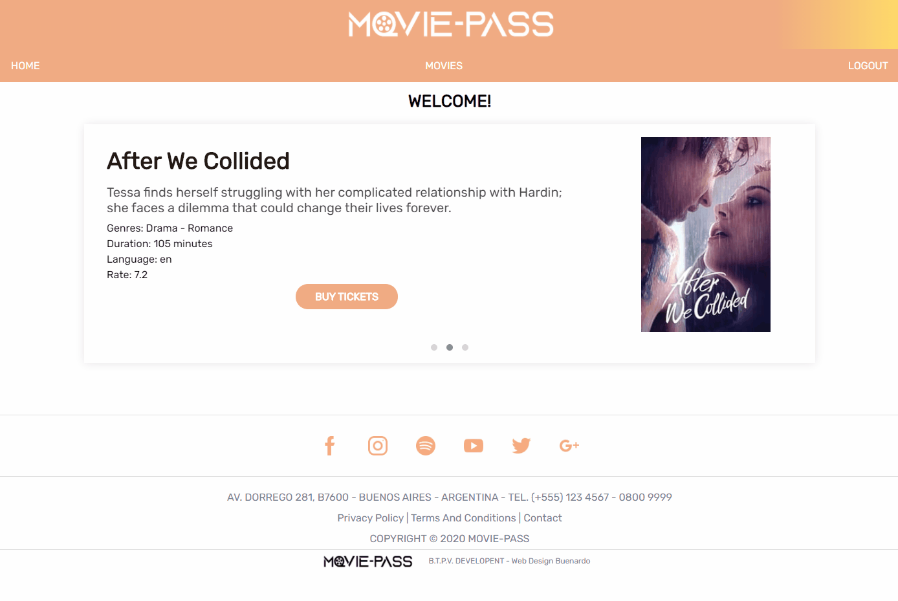

# Final Project : Moviepass

Contributors: Pedro Bazterrica - Leandro Toloza - Lautaro Nieves Perri - Facundo Villalba

## Description:

### MoviePass is a project of a cinema Managment from the National Technological University Of Mar Del Plata which provides the user a full Cinema Management System. 

## Features:

  - User Management (With Roles)
  - Cinema Management
  - Cinema Shows
  - Updated Movies for Billboard (API: https://developers.themoviedb.org/3 )
  - Purchase Management (Working on)
  - Database Storage
